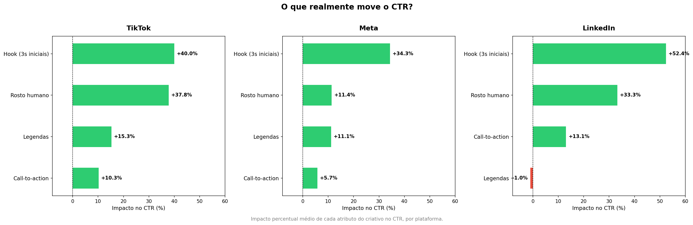
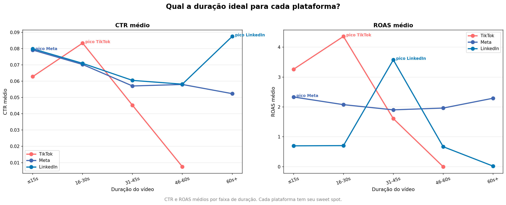
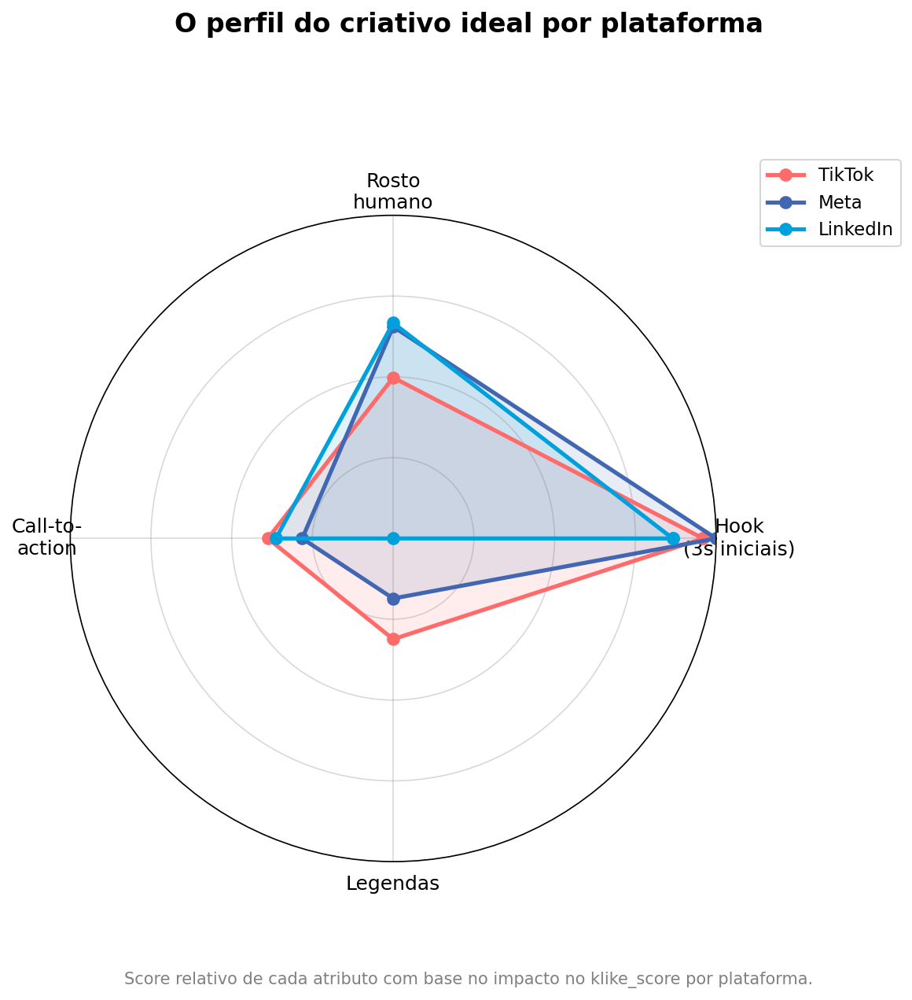

# Klike Data Science Challenge

Este projeto consiste na análise de dados de campanhas de marketing, construção de modelos preditivos e desenvolvimento de uma recommendation engine para otimização de criativos.

---

## 🚀 Como rodar o projeto

### 1. Clonar o repositório

```bash
git clone <url-do-repositorio>
cd Klike-Data-Science-Challenge
```

### 2. Criar e ativar ambiente virtual

#### Linux / Mac
```
python3 -m venv venv
source venv/bin/activate
```
#### Windows
```
python -m venv venv
venv\Scripts\activate
```
### 3. Instalar dependências
```
pip install -r requirements.txt
```

## 📂 Estrutura do Projeto

O projeto está organizado em quatro notebooks principais, seguindo uma abordagem modular e sequencial, que cobre desde o tratamento dos dados até a construção da recommendation engine.

---

### 01_data_preprocessing.ipynb

Responsável pelo tratamento e preparação dos dados.

Principais etapas:
- Análise inicial da base
- Tratamento de valores nulos
- Criação de variáveis auxiliares
- Padronização de colunas e tipos de dados

O objetivo deste notebook é garantir que os dados estejam consistentes e prontos para análise e modelagem.

---

### 02_eda.ipynb

Contém a análise exploratória dos dados (EDA).

Principais análises:
- Distribuição das variáveis
- Identificação de padrões e correlações
- Impacto de atributos criativos nas métricas de performance
- Comparações por plataforma

Este notebook tem como objetivo extrair insights relevantes sobre o comportamento das campanhas e orientar as etapas seguintes.

---

### 03_modeling.ipynb

Responsável pela construção e avaliação dos modelos preditivos.

Principais etapas:
- Definição das features e variável alvo
- Criação de pipelines de pré-processamento
- Treinamento de diferentes modelos (Ridge, Random Forest e XGBoost)
- Avaliação utilizando métricas como RMSE e R²
- Validação dos modelos (resíduos, cross-validation, etc.)

O foco desta etapa é entender a capacidade preditiva dos atributos criativos e identificar relações relevantes para a recomendação.

---

### 04_recommendation_engine.ipynb

Implementa a lógica da recommendation engine.

Principais etapas:
- Tradução dos insights obtidos no EDA e modelagem em regras acionáveis
- Simulação de alterações em atributos criativos
- Geração de recomendações para melhoria de performance

O objetivo final é transformar os aprendizados do projeto em um sistema prático de apoio à decisão para otimização de campanhas.

---

### 🧠 Organização do Fluxo

O projeto segue um fluxo:

**Preprocessing → EDA → Modeling → Recommendation Engine**

## 1. Pré-processamento dos Dados

Nesta etapa, os dados foram tratados para garantir consistência, qualidade e adequação para análise e modelagem.

---

### Tratamento de Valores Nulos

Foram adotadas estratégias específicas para cada variável, considerando o contexto de negócio e a disponibilidade de informações:

- **revenue**
  - Valores nulos foram preenchidos utilizando a relação:
    ```
    revenue = roas × spend
    ```
  - Ambas as variáveis roas e spend estavam preenchidas permitindo construir revenue dos registros faltantes

- **cpc**
  - Valores ausentes foram calculados a partir de:
    ```
    cpc = spend / clicks
    ```
  - Aplicou-se a mesma estratégia feita para revenue

- **video_duration_s**
  - Valores nulos foram preenchidos com a mediana da distribuição.
  - A mediana foi escolhida por ser mais robusta a outliers.

- **has_subtitle**
  - Valores ausentes foram tratados como uma nova categoria: `"unknown"`.
  - Essa abordagem preserva informação potencialmente relevante ao invés de assumir ausência de legenda.
  - Em seguida, esses valores serão tratados como False para a modelagem

- **music_voice_ratio**
  - Valores nulos foram preenchidos com a mediana.
  - A variável já possui limites naturais (entre 0 e 1), o que reduz risco de distorção.

---

### Tipagem e Preparação das Variáveis

- Variáveis booleanas foram mantidas como binárias (True/False)
- Variáveis categóricas foram preparadas para encoding (One-Hot e Ordinal)
- Variáveis numéricas foram mantidas em formato contínuo para modelagem

---

### Considerações sobre Outliers

Apesar da identificação de outliers em algumas métricas, optou-se por **não realizar tratamento nesta etapa**, pelas seguintes razões:

- As principais variáveis utilizadas na modelagem são atributos criativos e de contexto, menos suscetíveis a outliers extremos
- O tratamento poderia remover variações relevantes do comportamento real das campanhas
- A decisão foi adiar possíveis ajustes para a etapa de modelagem, permitindo testes controlados

---

## 2. Análise Exploratória (EDA)

O objetivo desta etapa foi entender, de forma prática, o que realmente impacta a performance das campanhas — especialmente olhando para elementos criativos e diferenças entre plataformas.

---

### Principais sinais dos dados

De forma geral, algumas relações esperadas apareceram — por exemplo, vídeos mais longos naturalmente acumulam mais tempo de visualização. No entanto, esse tipo de correlação não é acionável do ponto de vista criativo.

Os insights mais relevantes vieram de atributos diretamente controláveis:

- Criativos com **formato mais horizontal** tendem a performar pior em engajamento  
- **Alta densidade de texto** impacta negativamente o CTR  
- Ou seja: criativos mais limpos e adaptados ao formato da plataforma performam melhor  

---

### O que mais impacta a performance dos criativos

Alguns padrões ficaram muito claros:

- **Hook nos primeiros segundos** é o principal driver de performance  
  - Aumenta significativamente o CTR e o tempo de visualização  
  - Indica que capturar atenção rapidamente é crítico  

- **Presença de rosto humano** tem forte impacto em engajamento e conversão  
  - Sugere que elementos humanos aumentam conexão e confiança  

- **Legendas** se destacam quando o objetivo é retorno financeiro (ROAS)  
  - Especialmente relevantes em contextos onde o usuário consome conteúdo sem som  

- **Call-to-action (CTA)** teve um efeito mais ambíguo  
  - Em alguns casos, pode até reduzir o engajamento  
  - Indica que CTAs muito diretos podem quebrar a experiência do usuário  

---

### Diferenças entre plataformas

Cada plataforma apresenta um comportamento bastante distinto:

- **TikTok**
  - Maior engajamento e ROAS  
  - Conteúdo precisa ser direto, dinâmico e prender atenção rapidamente  

- **Meta**
  - Performance mais equilibrada  
  - CTR levemente superior, mas sem grandes extremos  

- **LinkedIn**
  - Público mais qualificado  
  - Maior tempo de visualização e mais conversões  
  - Indica consumo mais atento e intencional  

---

### Como os atributos se comportam em cada plataforma

Ao analisar os atributos criativos por plataforma, os padrões ficam ainda mais interessantes:

- **Hook**
  - Extremamente eficaz no TikTok (impacto consistente em todas as métricas)
  - Pode prejudicar performance no LinkedIn quando muito agressivo  

- **Rosto humano**
  - Muito forte no LinkedIn (impacto expressivo em conversão e ROAS)
  - No TikTok, aumenta engajamento, mas nem sempre retorno financeiro  

- **Legendas**
  - Cruciais no LinkedIn  
  - Menos relevantes no TikTok  

- **CTA**
  - Funciona melhor no LinkedIn, onde o usuário já está em modo de decisão  

---

## 📈 Visualizações para o time de marketing

Para facilitar a interpretação e tomada de decisão, foram construídas três visualizações principais.

---

### 1. O que realmente move o CTR





Essa visualização mostra claramente quais atributos mais impactam o CTR em cada plataforma.

Principais takeaways:

- **Hook é dominante em todas as plataformas**
- **Rosto humano tem impacto consistente**
- **CTA tem impacto menor**
- No LinkedIn, **legendas podem até prejudicar CTR**, reforçando a necessidade de adaptação ao contexto

---

### 2. Qual a duração ideal dos vídeos





Aqui fica claro que não existe uma única resposta — cada plataforma tem seu próprio padrão:

- **TikTok e Meta**
  - Melhor performance em vídeos curtos (até 30s)  
  - Conteúdo precisa ser rápido e direto  

- **LinkedIn**
  - Vídeos longos performam melhor  
  - Público aceita conteúdo mais aprofundado  

---

### 3. Perfil do criativo ideal por plataforma





Essa visualização resume o “DNA” do criativo ideal em cada plataforma:

- **TikTok**
  - Forte em hook  
  - Uso moderado de rosto e CTA  
  - Conteúdo simples e direto  

- **Meta**
  - Perfil equilibrado  
  - Nenhum atributo se destaca isoladamente  

- **LinkedIn**
  - Forte presença de rosto humano  
  - CTA relevante  
  - Menor dependência de elementos típicos de entretenimento  

---

## 🎯 Conclusão da EDA

Os dados mostram que:

- **Criativo importa — e muito**
- Não existe uma fórmula única: **cada plataforma exige uma abordagem diferente**
- Elementos simples (hook, rosto, duração) têm impacto maior do que ajustes complexos de mídia  

Esses insights são a base para a construção da recommendation engine, que transforma esses padrões em recomendações práticas para otimização de campanhas.

## 3. Modelagem Preditiva do Klike Score

### Objetivo

Construir um modelo de regressão capaz de prever o `klike_score` — métrica de qualidade do criativo numa escala de 0 a 100 — a partir de atributos do vídeo e contexto da campanha, sem utilizar métricas de performance (CTR, ROAS, etc.), que só estão disponíveis após a veiculação.

---

### Features utilizadas

As features foram divididas em dois grupos:

**Atributos do criativo** — características do vídeo que o anunciante controla:  
`has_hook`, `has_face`, `has_cta`, `has_subtitle`, `format`, `text_density`, `video_duration_s`, `music_voice_ratio`

**Contexto da campanha** — informações fixas no momento da criação:  
`platform`, `objective`, `category`, `target_audience_age`, `is_retargeting`

Métricas de performance como `ctr`, `roas`, `engagement_rate`, `conversions` e `avg_watch_time_s` foram explicitamente excluídas para evitar data leakage — em produção, essas métricas não estão disponíveis antes da campanha ser veiculada.

---

### Pré-processamento

Cada grupo de features recebeu um tratamento específico via `ColumnTransformer`:

- **Booleanas (`has_hook`, `has_face`, `has_cta`, `has_subtitle`, `is_retargeting`)**: convertidas para 0/1. A coluna `has_subtitle` continha um terceiro valor (`"unknown"`), tratado como 0 (ausência do atributo).

- **Categóricas nominais (`format`, `platform`, `objective`, `category`)**: One-Hot Encoding com `drop="first"` para evitar a dummy trap.

- **Categóricas ordinais (`text_density`, `target_audience_age`)**: Ordinal Encoding com ordem explícita (`low < medium < high` e `18-24 < 25-34 < 35-44 < 45+`).

- **Numéricas contínuas (`video_duration_s`, `music_voice_ratio`)**: StandardScaler.

---

### Seleção do modelo

Foram avaliados três modelos via Stratified K-Fold com k=5, usando RMSE como métrica principal:

| Modelo            | RMSE (CV)     | R² (CV) |
|------------------|---------------|--------|
| Ridge (baseline) | 10.03 ± 0.50  | 0.580  |
| Random Forest    | 9.83 ± 0.90   | 0.594  |
| XGBoost          | 9.81 ± 0.88   | 0.597  |

Os três modelos apresentaram performance muito próxima, o que indica que a relação entre as features e o target tem componentes lineares relevantes. O XGBoost foi escolhido por apresentar o melhor equilíbrio entre performance e capacidade de capturar interações não-lineares entre features — o que se tornaria relevante na etapa de feature engineering.

---

### Tuning de hiperparâmetros

Foi aplicado `RandomizedSearchCV` com 50 iterações sobre o espaço de hiperparâmetros do XGBoost, cobrindo `n_estimators`, `max_depth`, `learning_rate`, `subsample`, `colsample_bytree` e `min_child_weight`.

**Melhores parâmetros encontrados:**

```python
{
    "max_depth": 3,
    "n_estimators": 200,
    "learning_rate": 0.05,
    "subsample": 0.8,
    "colsample_bytree": 0.6,
    "min_child_weight": 1
}
```

O `max_depth=3` foi o resultado mais revelador — árvores rasas performaram melhor, sugerindo que as relações nas features são relativamente simples e o modelo sem tuning estava overfittando.

### Resultado após tuning:

| Métrica        | Antes | Depois |
|----------------|-------|--------|
| RMSE (CV)      | 9.81  | 9.03   |
| RMSE (test)    | 10.58 | 9.20   |
| MAE (test)     | 8.50  | 7.42   |
| R² (test)      | 0.505 | 0.626  |
| Gap CV→test    | 0.77  | 0.17   |

A redução do gap CV→test de 0.77 para 0.17 foi o resultado mais importante — indica que o modelo passou a generalizar bem, não apenas a memorizar o conjunto de treino.

---

## Feature Engineering

A EDA revelou interações relevantes entre atributos do criativo e contexto da campanha — especialmente entre features booleanas e plataforma ou faixa etária. Foram criadas as seguintes features adicionais:

### Interações hook × plataforma:
`hook_tiktok`, `hook_linkedin`, `hook_meta`

### Interações face × faixa etária e plataforma:
`face_2534`, `face_1824`, `face_linkedin`, `face_tiktok`

### Interação legenda × plataforma:
`subtitle_linkedin` — motivada pelo impacto desproporcional de legendas no LinkedIn (+131.5% ROAS), onde o público frequentemente assiste sem som em ambiente corporativo.

### Score de qualidade do criativo:
`creative_quality_score` — soma dos atributos booleanos presentes (0 a 4), capturando o efeito cumulativo de múltiplos atributos positivos.

### Adequação da duração por plataforma:
`duration_fit` — flag binária indicando se a duração do vídeo está na faixa ótima para cada plataforma (≤15s no Meta, 16-30s no TikTok, 60s+ no LinkedIn), com base nos padrões identificados na EDA.

### Resultado com feature engineering:

| Métrica        | Tunado | Com FE | Melhora |
|----------------|--------|--------|--------|
| RMSE (CV)      | 9.03   | 8.81   | -0.22  |
| R² (CV)        | 0.597  | 0.675  | +0.078 |
| RMSE (test)    | 9.20   | 9.09   | -0.11  |
| MAE (test)     | 7.42   | 7.27   | -0.15  |
| R² (test)      | 0.626  | 0.635  | +0.009 |

O ganho mais expressivo foi no R² do cross-validation (+0.078), confirmando que as features de interação capturam padrões reais e não apenas ruído.

---

## Verificação das premissas

Foram verificadas as seguintes premissas antes e após o feature engineering:

**Resíduos vs predições:** distribuição homogênea em torno de zero, sem padrão de cone ou funil — homocedasticidade satisfatória.

**QQ-plot dos resíduos:** pontos aderentes à reta com desvios apenas nas caudas — normalidade dos resíduos satisfatória para os fins do modelo.

**VIF (Variance Inflation Factor):** todas as features contínuas e ordinais com VIF abaixo de 2, indicando ausência de multicolinearidade relevante.

**Distribuição do target (`klike_score`):** com skewness de -0.225 — distribuição praticamente simétrica, sem necessidade de transformação.

**Curva de aprendizado:** as curvas de treino e validação convergem mas ainda apresentam um gap de ~3 pontos de RMSE ao final, indicando que o modelo se beneficiaria de mais dados.

---

## Resultados finais e interpretação

| Métrica      | Valor |
|-------------|------|
| RMSE (test) | 9.09 |
| MAE (test)  | 7.27 |
| R² (test)   | 0.635 |

### O que esses números significam na prática:

Um RMSE de 9.09 indica que o modelo erra em média ~9 pontos na escala de 0-100. O MAE de 7.27 indica que o erro típico — sem penalizar fortemente os outliers — é de ~7 pontos. Numa leitura prática: se o modelo prediz um score de 70, o valor real provavelmente está entre 61 e 79.

O R² de 0.635 significa que o modelo explica 63.5% da variância do `klike_score` utilizando apenas metadados da campanha.

---

## Limitações e próximos passos

**Volume de dados:** com 500 registros, a curva de aprendizado mostrou que o modelo ainda não saturou — mais dados provavelmente melhorariam a performance de forma direta.

**Ausência de features visuais:** qualidade de produção, paleta de cores, ritmo de edição, qualidade do copy — nenhum desses fatores está disponível nos metadados. São exatamente as features que mais impactariam o klike_score e são discutidas na Parte 4.

**Target gerado por IA:** o `klike_score` é produzido pelo sistema de IA da Klike, o que adiciona uma camada de ruído irredutível — parte da variância não explicada pelo modelo pode ser simplesmente impossível de capturar com features de metadados.

**Uso recomendado:** o modelo deve ser utilizado como guia direcional de melhorias, não como preditor preciso de score absoluto. Ele é especialmente adequado para o Recommendation Engine — onde o que importa é identificar corretamente a direção e magnitude relativa das mudanças, não o valor exato do score.

## 4. Recommendations Engine — Klike


O Recommendations Engine foi desenvolvido com o objetivo de transformar insights de dados em **sugestões acionáveis e priorizadas** para otimização de criativos de vídeo.

A engine recebe como input os atributos de uma campanha e retorna recomendações específicas que podem melhorar:

- o **klike_score** (qualidade do criativo)
- métricas de negócio relevantes (**CTR, ROAS**, etc.)

---

### 🧠 Arquitetura da Solução

A engine foi construída com uma abordagem em **duas camadas complementares**, seguidas de um mecanismo de fusão e priorização:

Input campanha  → Camada 1 — Modelo preditivo (klike_score) → Camada 2 — Lookup (métricas de negócio) → Fusão das recomendações → Ranking final (Top N)


---

### ⚙️ Pré-processamento e Feature Engineering

Antes de qualquer predição, os dados da campanha passam por uma etapa de transformação:

### Conversão de tipos
- Variáveis booleanas convertidas para `0/1`
- Padronização de inputs inconsistentes (ex: `"True"`, `"False"`)

### Features derivadas

Foram criadas features para capturar **efeitos contextuais**, como:

- Interações com plataforma:
  - `hook_tiktok`, `hook_linkedin`, `hook_meta`
- Interações com audiência:
  - `face_1824`, `face_2534`
- Score agregado:
  - `creative_quality_score` = soma de elementos criativos
- Ajuste de duração por plataforma:
  - `duration_fit`

Essas features permitem ao modelo capturar padrões mais ricos do que apenas variáveis isoladas.

---

### 🧩 Camada 1 — Simulação com Modelo Preditivo

A primeira camada utiliza um modelo treinado para prever o **klike_score**.

#### Estratégia

Para cada feature acionável:
1. Simula-se uma alteração na campanha (ex: adicionar hook)
2. O modelo prediz o novo `klike_score`
3. Calcula-se o impacto: delta_score = score_novo - score_atual


#### Tipos de alterações simuladas

- Booleanas:
  - Ex: adicionar CTA, incluir rosto
- Categóricas:
  - Ex: mudar formato ou densidade de texto
- Numéricas (bucketizadas):
  - Ex: ajustar duração do vídeo

#### Saída

Lista de recomendações com:
- ação sugerida
- impacto estimado no klike_score

---

### 📊 Camada 2 — Lookup de Métricas de Negócio

A segunda camada utiliza uma **lookup table construída a partir da análise exploratória**.

Essa tabela captura o impacto médio de alterações em métricas como:

- CTR
- ROAS
- Engagement rate

#### Construção da Lookup

Para cada feature e segmento:

- Compara:
  - média com feature presente
  - média sem feature

delta_pct = (mean_with - mean_without) / mean_without


#### Segmentação

As análises são feitas principalmente por:
- **plataforma** (TikTok, Meta, LinkedIn)

Exemplos:
- impacto de `has_hook` no TikTok
- melhor duração por plataforma
- melhor formato por plataforma

#### Filtro de confiabilidade

- Apenas entradas com `n_with ≥ 10` são consideradas

---

### 🎯 Métrica Prioritária por Plataforma

Cada plataforma tem uma métrica principal considerada na recomendação:

| Plataforma | Métrica |
|----------|--------|
| TikTok   | CTR    |
| Meta     | CTR    |
| LinkedIn | ROAS   |

Isso garante que as recomendações estejam alinhadas com o comportamento típico de cada canal.

---

### 🔗 Fusão das Camadas

As duas camadas são combinadas para gerar uma recomendação final mais robusta.

#### Normalização

- `delta_score` → normalizado (Camada 1)
- `delta_pct` → normalizado (Camada 2)

#### Score final
score_final = 0.5 * score_c1 + 0.5 * score_c2


#### Intuição

- Camada 1 → impacto no **modelo**
- Camada 2 → impacto observado no **mundo real (dataset)**

A fusão equilibra **predição** e **evidência empírica**.

---

### 🏆 Priorização

As recomendações são ordenadas por `score_final` e retornadas como Top N.

Classificação:

- 🔴 Alto impacto
- 🟡 Médio impacto
- 🟢 Impacto moderado

---

### 💡 Exemplo de Output
🔴 Alto impacto — Recomendação 1
→ Adicionar hook nos primeiros 3s
• klike_score estimado: +6.2 pontos
• CTR estimado: +18.5% no TikTok

🟡 Médio impacto — Recomendação 2
→ Ajustar duração para 16-30s
• CTR estimado: +12.3% no TikTok


---

### ⚠️ Limitações

- A lookup captura **correlações**, não causalidade
- A fusão usa pesos fixos (0.5 / 0.5)
- Segmentação ainda limitada (principalmente por plataforma)
- Interações entre múltiplas mudanças não são consideradas

---

### 🚀 Possíveis Melhorias

- Incluir segmentação por:
  - categoria
  - objetivo da campanha
  - audiência
- Aprender pesos da fusão automaticamente
- Incorporar intervalos de confiança nas recomendações
- Modelar efeitos combinados (multi-feature changes)
- Integrar features extraídas diretamente do vídeo


## 5. Visão de Produto

Com acesso direto ao vídeo (e não apenas aos metadados), seria possível enriquecer significativamente o modelo com features que capturam a qualidade real do criativo.


- **Qualidade visual**, incluindo iluminação, nitidez, contraste e estética geral do vídeo  
- **Ritmo e edição**, como frequência de cortes, dinamismo e fluidez das transições  
- **Análise de áudio**, avaliando clareza da fala, proporção entre voz e música e uso de trilhas em tendência  
- **Qualidade do copy**, considerando clareza da mensagem, proposta de valor e uso de gatilhos de conversão  
- **Expressões e emoções**, capturando o impacto emocional transmitido pelo apresentador  
- **Primeiros segundos do vídeo**, analisando o hook real a partir dos elementos visuais e narrativos iniciais  

Essas informações permitiriam evoluir de um modelo baseado na **estrutura do criativo** para um modelo baseado na **qualidade da execução**, aumentando significativamente o poder preditivo.

---

A Recommendation Engine pode ser estruturada como um serviço modular integrado ao fluxo de criação de campanhas.

O funcionamento pode ser dividido em três etapas principais:

- **Processamento**
  - Aplicação do pipeline de pré-processamento
  - Inferência do modelo treinado
  - Simulação de alterações em atributos acionáveis  

- **Decisão**
  - Estimativa de impacto de cada mudança no `klike_score`
  - Priorização das recomendações com maior ganho esperado  

- **Saída**
  - Recomendações claras e interpretáveis (ex: adicionar hook, ajustar duração)
  - Estimativa de impacto esperado para cada ação  

Do ponto de vista de produto, a solução pode ser exposta via API e integrada diretamente em plataformas de criação de campanhas, funcionando tanto em tempo real quanto em análises batch. Em termos de infraestrutura, o uso de containers e cloud permite escalar facilmente a análise para múltiplos criativos.

A engine deve ir além da predição e atuar como um sistema de apoio à decisão, transformando dados em ações concretas.

---

Com mais tempo, existem algumas frentes claras de evolução:

- **Enriquecimento de features**
  - Uso de visão computacional para análise de vídeo  
  - Aplicação de NLP para análise de copy e legendas  
 
- **Análise causal**
  - Diferenciar correlação de causalidade  
  - Uso de experimentos ou abordagens inspiradas em A/B testing  

- **Segmentação mais granular**
  - Modelos específicos por plataforma, categoria ou objetivo  

- **Evolução da recommendation engine**
  - Simulação de múltiplas alterações simultâneas  
  - Otimização do criativo como um problema de maximização  

- **Camada de produto**
  - Dashboard interativo  
  - Visualização de impacto das recomendações  
  - Explicabilidade dos outputs do modelo  

---

## Conclusão

O projeto demonstra que é possível prever a performance de criativos com boa precisão utilizando apenas metadados — e, principalmente, transformar esses insights em recomendações práticas.

O maior valor está na capacidade de orientar decisões criativas de forma estruturada e baseada em dados, reduzindo tentativa e erro e aumentando a eficiência das campanhas.